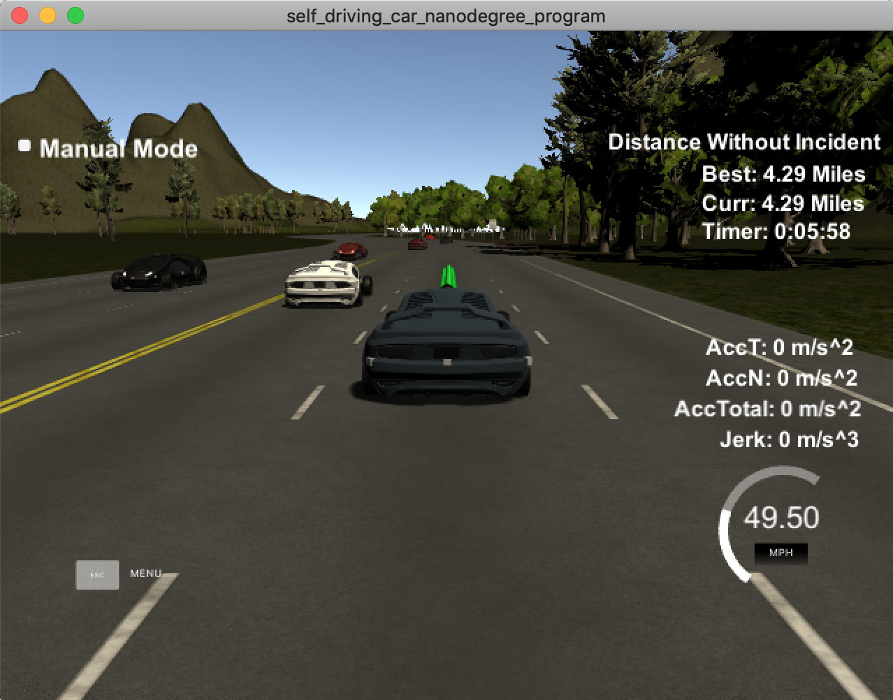
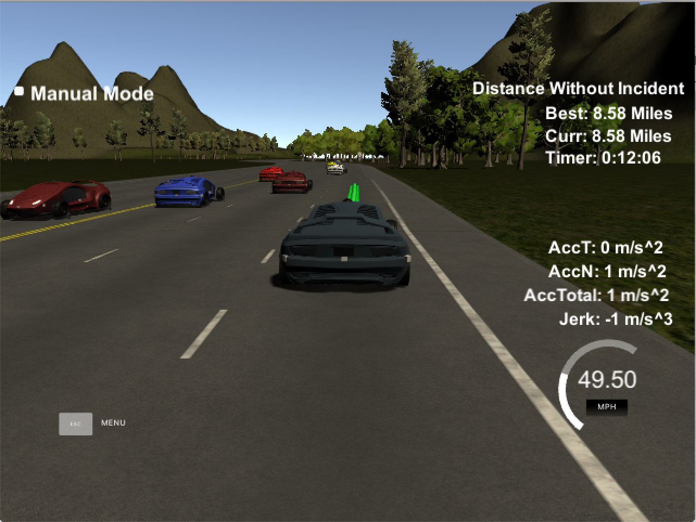
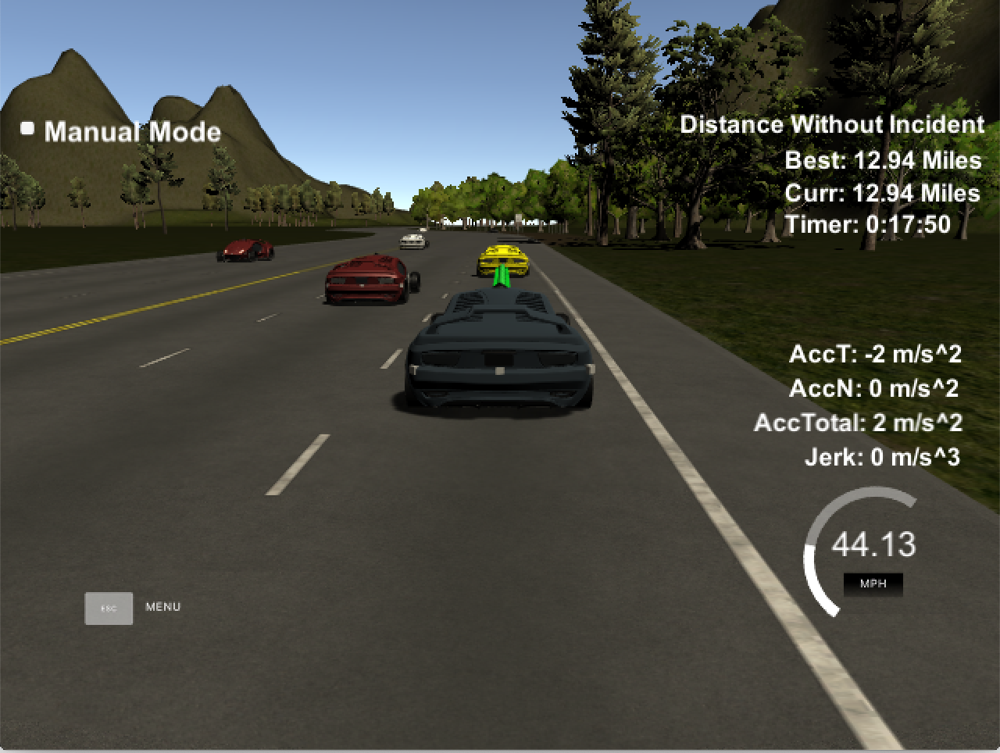

# CarND-Path-Planning-Project-Write-Up
Self-Driving Car Engineer Nanodegree Program
   
### Goals
The goal of this project is to safely navigate around a virtual highway with other traffic that is driving +-10 MPH of the 50 MPH speed limit. 

### Overview

In order to realized the goal that make the car to safely navigate around a virtual highwary with driving speed to 50 MPH speed limit, the following parts are implemented.

- Design a strategy about lane change handling. 
- Generate the path planning ponits.
- Test

### Part 1. Lane change handling

  In order to make our car to drive at a related high speed close to speed limit, we may want to change our car to an empty lane if the car in the front of our car drives slow, so the lane change shall be handling.

- Inputs

  In this part, the sensor fusion data (such as other cars' *s*,*d*,*x*,*y*,*vx*,*vy*) is used.

- Handling

  (1) Check the range of our car
  
  Based on the sensor fusion data, the cars that are around our car can be found. 
  Here, two arrays *too_close_front[]* and *too_close_behind_parallel[]* are defined to indicate if there are cars in the front or parallel or behind in our car.
  
  Due to that there are 3 lanes in our car driving directions, so the two array sizes are 3 which is defined by the MACRO *LANE_NUM*.
  The check range is 30m +/- our car's s coordinate which is deinfed by the MACRO *SAFE_DISTANCE*.
  
  (2) Lane change strategy
  
  As we had got the indicators of all the 3 lanes to show that if there are cars in the front or parallel or behind of our car, the lane change strategy can be decided.
  
  If we found that our car is too close to the front car in our current lane, we may change our car's lane. We will decrease our car's speed to avoid collision with the front car first, and then we may consider to change our car's lane. If not, we may increase our car speed but shall not beyond the *VELOCITY_LIMIT*. In order that not experience larger total acceleration and jerk that is greater, *VEL_UPDATE_INC* and *VEL_UPDATE_DEC* are defined and are used for decrease the speed or increase the speed.
  
  - If our car was driving in the left lane, we will check the two indicators of the middle lane we got in (1). If both of the two indicators of middle lane are false, we will change our car to the middle lane.
  - If our car was driving in the middle lane, we will check the two indicators of the left lane. If both of the two indicators of left lane are false, we will change our car to the left lane. Otherwize, we will check the two indicators of right lane. The same handling with the previous description was adopted.
  - If our car was driving in the right lane, we will check the two indicators of the middle lane we got in (1). If both of the two indicators of middle lane are false, we will change our car to the middle lane.
  
  The code is in line 135 - line 220.
  
- Outputs

  - the updated driving lane
  - the updated speed

### Part 2. Generate path planning points.

Path planning points are generated in this part.

- Inputs

    - The updated speed in Part 1.
    - Our car's localization data and map list of waypoints around the highway. 
    - previous path data
    
- Handling
  
 In order to generate path planning points, a spline function will be used and 5 points are used to obtain the spline function.

 The 5 points are 2 points in the previous path and 3 points we defined which's distance to our car are 30ms, 60ms, 90ms.
 
 We transmit the 5 points to the local coordinates, and then spline was used. I had added *#include "spline.h"* in line 10. Based on the 5 points and *tk::spline*, we can get the spline function which defined in the code as *s*.
  
 As we hand got the spline function *s*, we can use it to generate the path planning points. Using spline will make the path smoothly. Here, another thing to make the path smoothly is that the previous path points are used. 
 
 After the path planing points had been obtained, these points shall be transmitted to global coordinates. At last, these points are push back into the vector *next_x_vals* and *next_y_vals*.
 
- Outputs

  - *next_x_vals*
  - *next_y_vals*

### Part 3. Test

 After compiling and running, some test screenshots are here. The car can run a whole loop with collosing or beyond the acceleleration and Jerk.
 
 
 
 